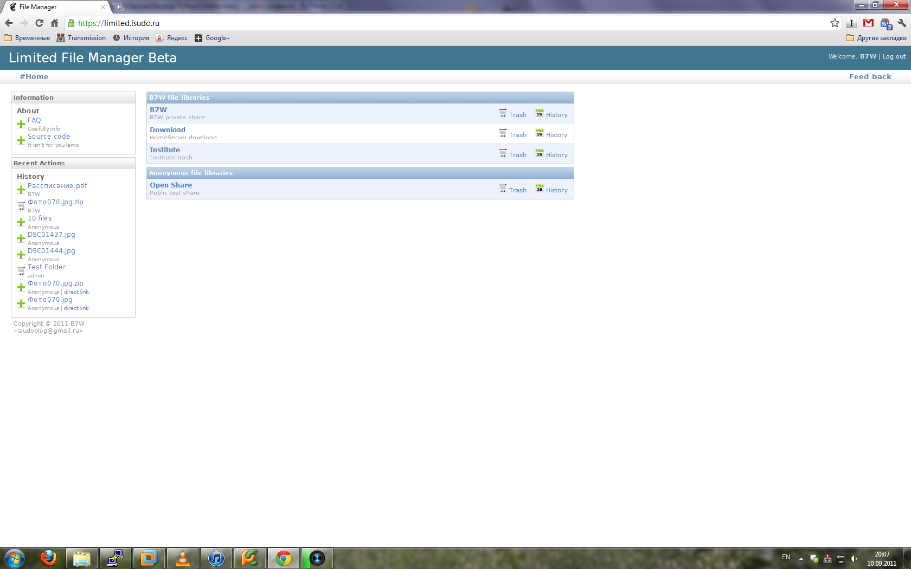

************************************
Overview
************************************

.. index:: Overview

About
===================================

.. index:: About

| Limited is a simple file manager written in python with django.
  There isn't a lot of javascript, heavy interfaces and etc.
  It's work pretty well with mobile devices.
  You can upload multiple files, download folders and make base file operations.

| This project develop with 2 main ideas: various file shares and permissions for them.
  So manager support action limitations:

* edit - rename
* move - move file and folders
* create - create new folded
* upload - multiple file upload ( provide by html5 )
* http_get - download files wia http protocol from other resources

| Also manager can zip/unzip and create direct link that free of permission and have max age.

| Limited can manage various file libs for each user with specified permission,
  plus Anonymous libs if turn on and in database created special user.
  if User have the some lib as Anonymous, the Users permission will be taken.

| Photos can be viewed in a beautiful gallery. Where implemented privies and full screen images.

| Super user can view and edit all libs.

| File manager have simple history and Trash bin.
  All deleted file first move to trash.

| For feedback look here :doc:`click </intro/feedback>`

| Working application you can look `here <http://limited.isudo.ru/>`__

| Limited file manager is open source project, released by BSD license.

.. index:: Features

Functional features
===================================

| Here I'd like to tell about some specific function.

* | Limited can delegate serving files to nginx with 'X-Sendfile'.
    It can greatly save resources.
    Also you can write you backend for other http servers.
* | Downloading big folders that pack to zip archive are running in background.
    User just see message to wait a little and try latter. Also archived folders are caching.

.. index:: Screen shots

Screen shots
===================================

**User home page, with private and open file repositories.**

**Files of one of repositories.**

